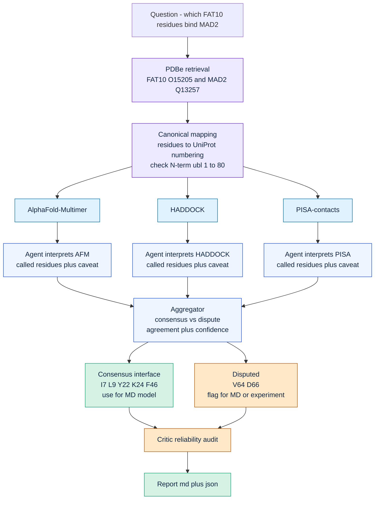

# FAT10 : MAD2 Interface-Tool Adjudication — Flow

The agent layer does not predict the interface. Several prediction tools do that;
the agents **compare, adjudicate, and audit** them — surfacing where the tools
agree (use for MD) and where they disagree (flag for MD / experiment).

**Where this plugs into the team's plan:** the project flow is
*compare interface-prediction tools → pick one interface model → run MD →
interface features for inhibitor design.* This layer automates the
**compare → pick** step and produces an auditable, evidence-grounded interface
selection instead of a by-hand choice.
