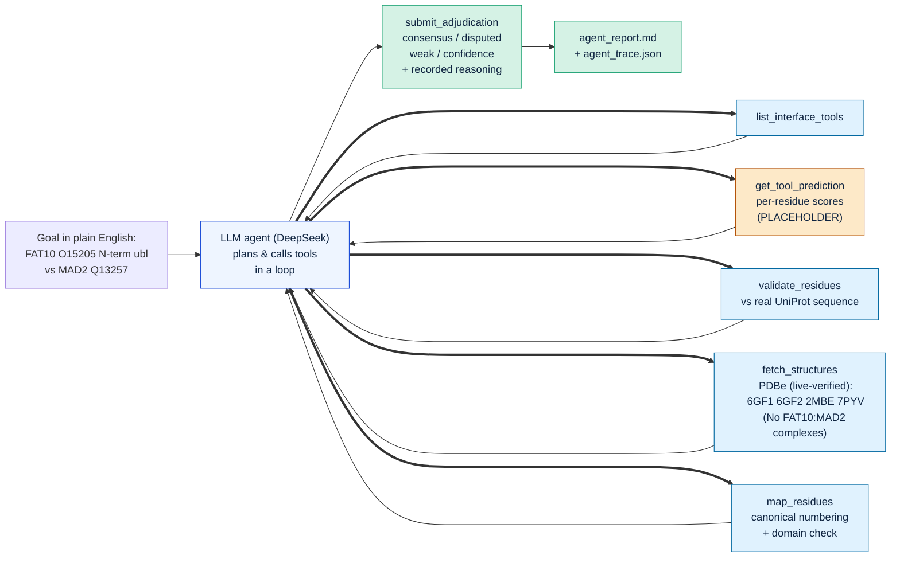
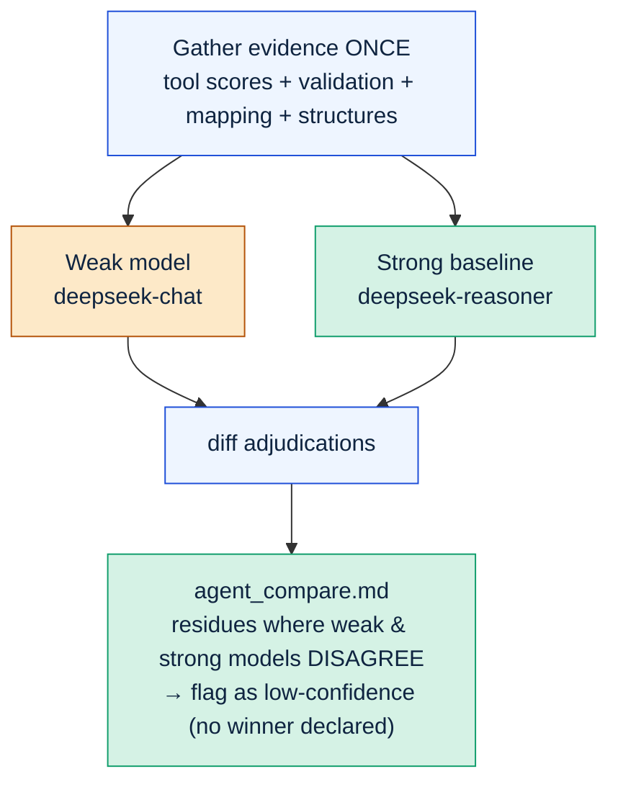

# Pipeline Flow — Interface-Adjudication Agent

The agent does **not** predict interfaces. Prediction tools do that; the agent
**compares, validates, adjudicates, and audits** them. The diagrams below show
the genuine agentic loop and the audit.

> **Honest status:** every box below is real *machinery* (LLM loop, PDBe
> retrieval, UniProt sequence validation, model comparison) **except the tool
> interface scores, which are placeholder/demo numbers.** Any FAT10 conclusion is
> therefore a method demo, not a real result, until real tool scores are plugged
> in (`INTERFACE_SCORES`). The PDB IDs were **confirmed by a live PDBe query** and
> are genuine FAT10 structures — but **none are FAT10:MAD2 complexes** (no such
> structure exists), so they confirm the protein's identity, not the interface.

## 1. Agentic loop (the LLM drives, in a loop)

## 2. Reliability audit — weak vs strong model

**Where this plugs into the team's plan:** the project flow is *compare
interface-prediction tools -> pick one interface model -> run MD -> interface
features for inhibitor design.* This agent automates the **compare -> pick** step
with grounding (real sequence/structure) and audit (model comparison), so the
interface model is chosen in an auditable way rather than by hand.
