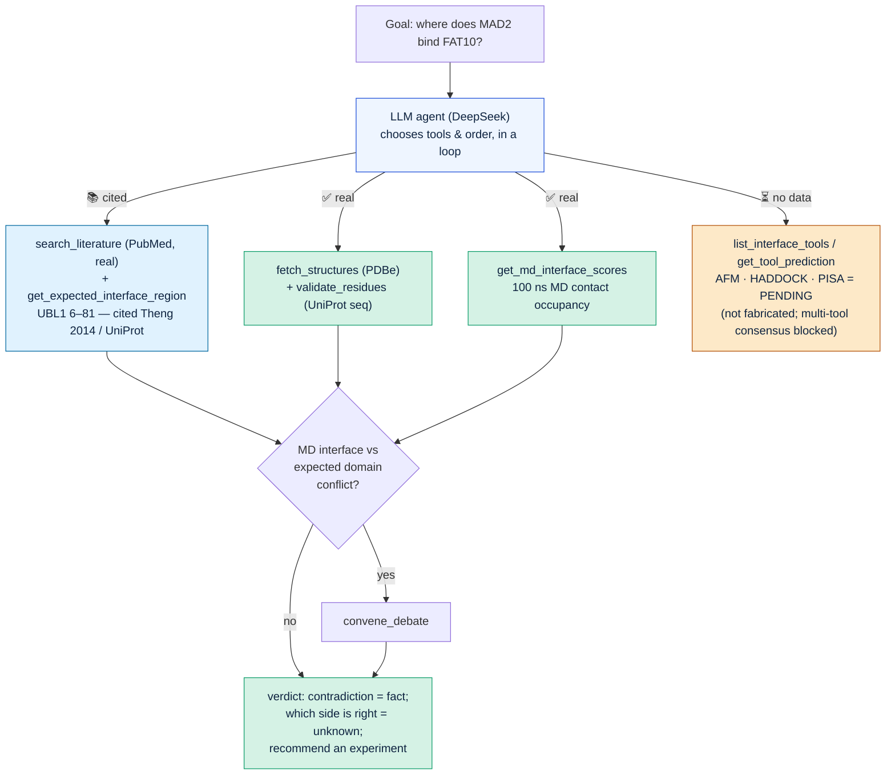
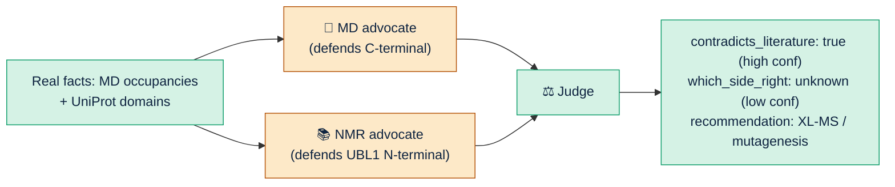

# Pipeline Flow — Autonomous FAT10–MAD2 Interface Investigation

You give one goal; the **LLM agent decides the tool order itself** and reaches a
calibrated verdict. Legend: ✅ real data · 📚 cited literature fact · ⏳ no data yet.

## 1. Autonomous agent loop

## 2. The multi-agent debate (the highlight)

## Honest status — what is real vs not

| Part | Status |
| --- | --- |
| Agent loop (LLM picks tools/order itself) | ✅ real |
| MD per-residue contact occupancy | ✅ real (your 100 ns run) |
| PDBe structures + UniProt domain boundaries | ✅ real (live-verified) |
| Multi-agent debate + judge | ✅ real LLM over real facts |
| Expected binding region (UBL1) | 📚 **cited fact** (Theng 2014 / UniProt) — hand-fed, corroborated by `search_literature`, NOT derived by the agent |
| **AFM / HADDOCK / PISA multi-tool scores** | ⏳ **no data yet** — reported as *pending*, never fabricated. The "compare tools → pick best model" step is blocked on team data. |
| Any claim of the *true* interface | ❌ no experimental complex structure exists — not ground truth |
