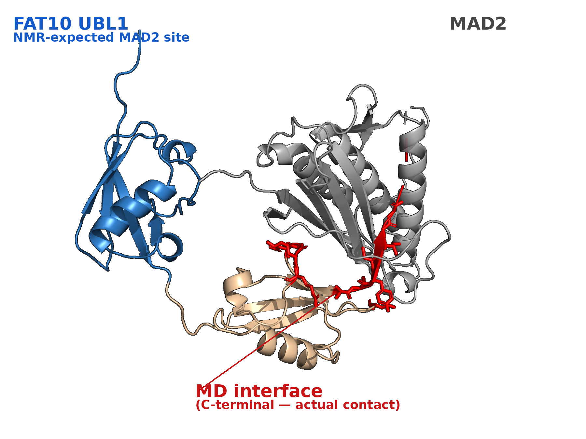

# Interface Adjudicator

*An autonomous LLM agent that adjudicates protein–protein interfaces from real evidence.*
**Case study: FAT10–MAD2.**



An LLM agent that adjudicates where **MAD2** binds **FAT10**, grounding every fact in
a tool call — PDBe structures, the real UniProt sequence, a 100 ns molecular-dynamics
run, and PubMed — and, when the evidence conflicts with the literature, convening a
**multi-agent debate** to reach a *calibrated* verdict instead of a false one.

The agent does not predict interfaces or invent numbers. It retrieves, validates,
compares the real MD contact map against the literature-expected binding region, and
— crucially — when the model and the literature disagree it reports the **contradiction
as a fact without declaring a winner**, because no experimental FAT10–MAD2 complex
exists to serve as ground truth.

## The finding this pipeline surfaces

The 100 ns MD (run on an AlphaFold3 starting model) puts the persistent FAT10–MAD2
interface on FAT10's **C-terminal region** (I163, C162, G164, C160, G165, Y161 …),
while the literature/NMR expects MAD2 to bind FAT10's **N-terminal UBL1 domain
(residues 6–81)**. Every persistent contact falls *outside* the expected region, so
the deterministic check **flags the model** and the debate recommends an experiment —
it does not pronounce the MD "right" or the literature "wrong."

## Architecture

```
goal ─▶ [ReAct agent: DeepSeek plans + calls tools in a loop]
             │
             ├─ search_literature            → PubMed abstracts (live) / cited fallback
             ├─ get_expected_interface_region→ UBL1 6–81 (UniProt + Theng 2014, CITED)
             ├─ fetch_structures             → PDBe live MCP query → fallback: verified FAT10 snapshot
             ├─ validate_residues            → real UniProt sequence (catches bad numbering)
             ├─ get_md_interface_scores      → real 100 ns MD contact occupancy
             └─ convene_debate  ─▶ [MD advocate] vs [NMR advocate] ─▶ [Judge → calibrated verdict]
             │
        submit_adjudication  →  report + full reasoning/tool trace
```

Design principles: **no fabricated data** (unavailable tools report `pending`, never
placeholder numbers); **no false ground truth** (contradictions are reported, winners
are not declared); every residue and score originates from a tool, never the model.

## v1 → v2: what was added and why

v1 was evaluated on one case (n = 1). v2 keeps every v1 capability and adds what a
trustworthy agent project needs: tests, run logs, an evaluation, and a way for
non-programmers to use it.

| Added | Why |
| --- | --- |
| **Tests + CI** (`tests/`, `.github/workflows/tests.yml`; `pytest -q` runs offline with no key, `--run-live` for network tests) | v1 had none; a regression test pins the FAT10–MAD2 behaviour |
| **Run logging** (`results/runs.jsonl`: tokens, latency, tool order, cost from `config/pricing.yaml`) | to know what a run costs and how long it takes |
| **Benchmark** (`benchmark/`, `scripts/run_benchmark.py`; design in `docs/benchmark_design.md`) | replaces "works on one case" with a score over several protein pairs that have experimental complexes |
| **Answer-leak prevention** (`agent/leakage.py`) | the agent must not see any experimental complex of the pair it is asked about, nor its papers |
| **No-tool baseline** (same model, no tools) | measures what the tools add over the model reciting a classic complex it may have seen in training |
| **Error injection** (`agent/error_injection.py`, FAT10–MAD2) | measures whether wrong input (shifted numbering, out-of-range residues, fabricated MD scores, wrong UniProt accession) is caught, and reports what is not |
| **Generalised inputs** (`agent/cases.py`, `cases/`) | tools take the protein pair from a case instead of FAT10/MAD2 constants |
| **Live PDBe query wired in** | v1 described it but did not call it; the README status now matches the code |
| **Dify access** (`docs/openapi.json`, `docs/dify_setup.md`, `docs/user_guide.md`) | lets non-technical scientists use it through the existing API |
| **Business case** (`docs/business_case.md`) | manual vs agent workflow, cost and time per run, risks |

The FAT10–MAD2 finding is unchanged: the MD interface (C-terminal) and the literature/NMR
expectation (UBL1 6–81) are reported as a contradiction, without declaring a winner.

### Results

<!-- GENERATED:BENCHMARK:START -->
Model `deepseek-chat`, 3 run(s) per case and arm, generated 2026-09-26T08:17:57Z. Score = mean of the two proteins' region hits (recall ≥ 50%, predicted length ≤ 2× the true span).

| pair | truth PDB | agent | no-tool baseline |
|---|---|---|---|
| B2CL1-BAK | 1BXL | 0.50 | 0.00 |
| CDK2-CCNA2 | 1FIN | 0.17 | 0.00 |
| MDM2-P53 | 1YCR | 1.00 | 1.00 |
| PCNA-CDN1A | 1AXC | 0.50 | 0.50 |
| RASH-RAF1 | 4G0N | 0.00 | 0.00 |
| **overall** | | **0.43** | **0.30** |

Error injection (FAT10–MAD2): 6 of 7 injected errors caught (86%); passed through 1; inconclusive 0.

Full table (stability, latency, cost): [`results/benchmark.md`](results/benchmark.md).
<!-- GENERATED:BENCHMARK:END -->

How to read it: the baseline is the same model answering from memory, so a classic
complex it has seen in training can score well without any tools; the agent-minus-baseline
gap is what the tools add. Few pairs and few runs per pair make a small sample: the numbers
are indicative, not statistically established. Regenerate with
`python scripts/run_benchmark.py` then `python scripts/generate_docs.py`.

## Honest status — real vs cited vs pending

| Component | Status |
| --- | --- |
| ReAct agent loop (LLM plans, calls tools, reasons, in a loop) | ✅ real |
| 100 ns MD contact occupancy (per-residue MAD2 contact fraction) | ✅ real evidence (own Amber run) |
| `validate_residues` vs the real UniProt O15205 sequence | ✅ real · ✅ the MD residue labels were checked against the live UniProt sequence on 2026-09-26 (`live` test passed) |
| PDBe retrieval — `fetch_structures` queries the PDBe MCP search server live (`uvx pdbe-mcp-server`) and falls back to a verified FAT10 snapshot (6GF1, 6GF2, 2MBE, 7PYV) when `uvx` or the network is unavailable | ✅ snapshot entries are genuine FAT10 structures (none are FAT10:MAD2 complexes — none exist) · ✅ the live path is wired, unit-tested, and its `live` test passed against PDBe on 2026-09-26 (local machine; see `docs/progress.md`) |
| FAT10 domain boundaries (UBL1 6–81, UBL2 90–163) | ✅ verified from the UniProt feature table |
| Expected binding region (MAD2 → UBL1) | 📚 cited (Theng et al. 2014 PNAS; NMR PDB 2MBE) — not derived here |
| Multi-agent debate + calibrated judge | ✅ real mechanism |
| Weak-vs-strong model comparison | ✅ real mechanism |
| Benchmark over protein pairs with experimental complexes (agent vs no-tool baseline) | ✅ real live run; scores in the generated results table (small sample, indicative only) |
| Error injection on FAT10–MAD2 | ✅ real live run against UniProt; it also reports what is *not* detected (fabricated score values on real residue labels) |
| Dify integration (`docs/dify_setup.md`) | ⏳ documented and the API schema is tested, but not walked through on a real Dify install |
| AFM / HADDOCK / PISA per-residue scores | ⏳ pending — no team data yet; reported as `pending`, never faked |
| Which side (MD vs literature) is correct | ❌ unknown — no experimental complex; the pipeline recommends a test |

## Quickstart

### Run the API (Docker)

```bash
docker compose up --build          # serves on http://localhost:8000
# or:
docker build -t fat10-adjudicator .
docker run -p 8000:8000 -e DEEPSEEK_API_KEY=sk-... fat10-adjudicator
```

### Run the API (local)

```bash
python -m venv .venv && source .venv/bin/activate
pip install -r requirements.txt
uvicorn api.main:app --reload      # http://localhost:8000/docs
```

| Endpoint | Needs key? | What it does |
| --- | --- | --- |
| `GET /` | no | the single-page web client (see below) |
| `GET /info` | no | service description and endpoint list |
| `GET /api/cases`, `POST /api/run` | run needs the key | the JSON API behind the web page |
| `GET /health` | no | liveness + whether the LLM is configured |
| `GET /evidence` | no | real MD occupancy + expected region + the deterministic conflict flag |
| `POST /adjudicate` | yes | run the autonomous investigator agent end-to-end |
| `POST /debate` | yes | run the multi-agent debate and return the judge's verdict |
| `GET /docs` | no | interactive OpenAPI docs |

### Web client

A single plain-HTML page, served by the same FastAPI app (no extra dependency, no external assets).

```bash
export DEEPSEEK_API_KEY=...             # needed to run a query; the page itself loads without it
uvicorn api.main:app --host 127.0.0.1 --port 8000
# then open http://localhost:8000/      (with Docker: docker compose up --build, same address)
```

Pick a preset case or type two UniProt accessions and press "运行". The page shows a
plain-language conclusion, an evidence table where every row is labelled **实时** (live),
**引用** (cited) or **待定** (pending), and the time and cost of that query.

### Run the pipeline directly (CLI)

```bash
export DEEPSEEK_API_KEY=...
python -m agent.run_agent          # autonomous agent  → outputs/agent_report.md (+ trace)
python -m agent.debate             # multi-agent debate → outputs/debate_report.md
python -m agent.compare            # weak-vs-strong     → outputs/agent_compare.md
python analysis/adjudicate_md.py   # deterministic conflict check (no key, no network)

pytest -q                                             # offline tests, no key
pytest --run-live                                     # + network tests
python scripts/run_benchmark.py --dry-run             # plumbing check with a fake client (not accuracy)
python scripts/run_benchmark.py --cases benchmark/ --runs 3   # live benchmark (needs the key)
python scripts/run_error_injection.py                 # FAT10-MAD2 error injection (needs network)
python scripts/generate_docs.py                       # refresh README results + business case numbers
```

## Repository layout

```
agent/       ReAct agent: llm_client, tools, structures (PDBe MCP client),
             literature (PubMed), debate (advocates + judge), run_agent, compare;
             v2: cases, leakage, scoring, baseline, benchmark, error_injection, runlog
cases/       the FAT10–MAD2 case (cases/fat10_mad2.yaml)
benchmark/   benchmark pairs (generated by scripts/make_benchmark_cases.py)
results/     run log, benchmark and error-injection outputs (script-generated)
scripts/     run_benchmark, run_error_injection, export_openapi, generate_docs, ...
tests/       offline test suite (pytest -q)
docs/        current state, benchmark design + evidence, Dify setup, user guide, business case
analysis/    MD → per-residue scores, deterministic adjudication, HTML report, figure render
api/         FastAPI service (api.main:app)
skills/      Agent role prompts as loadable Markdown files (investigator, advocates, judge)
notebooks/   Executable walkthrough of the pipeline
FLOW.md      Architecture diagrams
```

## Data provenance & limitations

- The MD interface reflects the AF3 *starting pose*, so it is a **consistency check on
  that model, not independent validation** of the binding site.
- Analysis is a **single MD replica (n = 1)**.
- The "AlphaFold docked the flexible C-terminal tail" explanation is a **hypothesis**,
  not proven; confirming it needs AF3's own ipTM/PAE at that interface.
